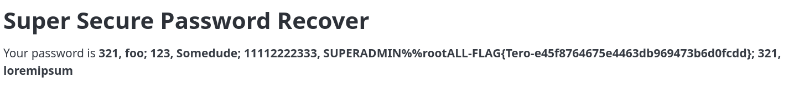
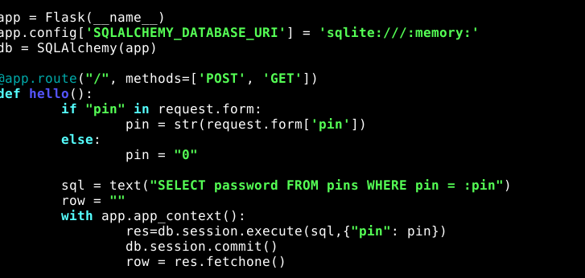
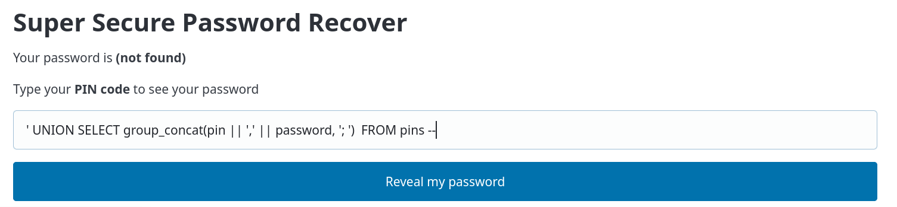
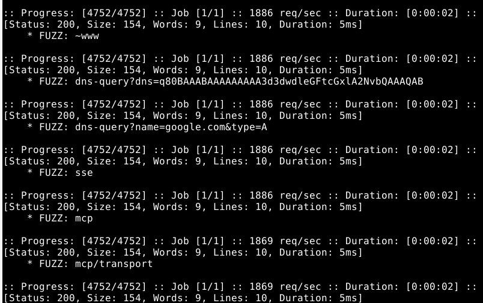
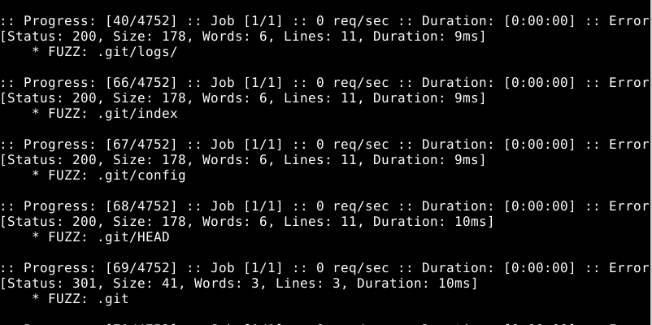
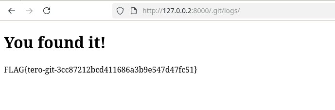
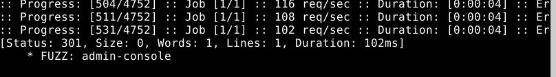
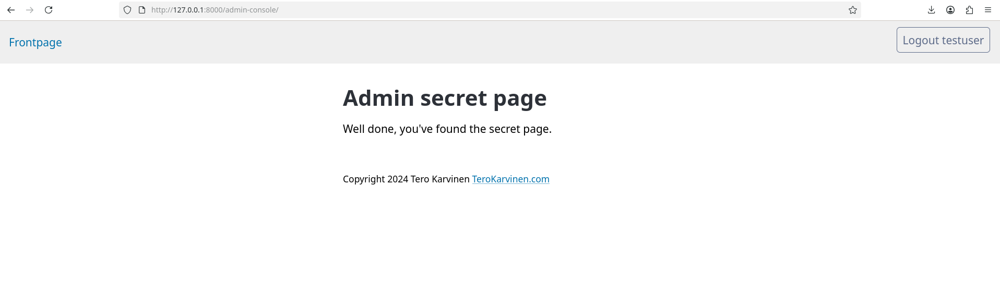
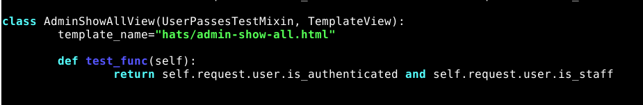

## Break into 010-staff-only. See Karvinen 2024: Hack'n Fix

## a) SQL-injektio

### Haavoittuvuuden löytäminen

- Käynnistin tehtävän sovelluksen.
- Kokeilin PIN-koodilla `123` ja sain salasanaksi `Somedude`.
- Kokeilin SQL-injektiota `' OR 1=1`, mutta kenttä hyväksyi vain numeroita.
- Avasin Inspectorin `Ctrl + Shift + C` ja muutin PIN-kentän `input type="number"` → `input type="text"`.
- Tämän jälkeen SQL-injektio toimi ja sain salasanaksi `foo`.

### Tietokannan tutkiminen

Selvitin ensin tietokannan taulut:

```sql
' UNION SELECT group_concat(name, ', ') FROM sqlite_master WHERE type = 'table' --

Tulokseksi sain pins.

Selvitin seuraavaksi pins-taulun sarakkeet:

' UNION SELECT group_concat(name, ', ') FROM pragma_table_info(pins)

Tulokseksi sain:

id, pin, password

Tämän jälkeen hain taulun sisällön:

' UNION SELECT group_concat(pin || ', ' || password, '; ') FROM pins --

Tuloksissa näkyi PIN 11112222333 ja siihen liittyvä SUPERADMIN-salasana.

Syöttämällä PIN-koodin 11112222333 sain tehtävässä haetun flagin.
```




b) SQL-injektion korjaaminen

Haavoittuvuuden tutkiminen

Avasin tehtävän Python-koodin ja tutkin kohdan, jossa SQL-kysely muodostettiin.

Käyttäjän syöte päätyi suoraan SQL-kyselyyn, mikä mahdollisti SQL-injektion.

Kysyin ChatGPT:ltä (GPT-5.6 Luna), miten löytämäni haavoittuvuus voidaan korjata. Sain ehdotukseksi parametrisoidun SQL-kyselyn käyttöä.

Korjaaminen

Muutin SQL-kyselyn parametrisoiduksi kyselyksi.



Testaus

Testasin korjausta käyttämällä samaa SQL-injektiota kuin kohdassa a.

Korjauksen jälkeen salasana ei enää tullut näkyviin, joten injektio ei enää toiminut samalla tavalla.




c) Hidden Web Directories / ffuf
Tehtävän suorittaminen

Latasin dirfuzt-1-tehtävän samalla tavallu kun dirfuzt-0 ja käynnistin sen.

Käytin ffuf-työkalua yhdessä common.txt-sanaston kanssa:

./ffuf -w common.txt -u http://127.0.0.2:8000/FUZZ



Haku tuotti paljon tuloksia, koska palvelin palautti samanlaisen vastauksen myös olemattomille sivuille.

Suodatin yleisen vastauksen pois -fs-parametrilla:

./ffuf -w common.txt -u http://127.0.0.2:8000/FUZZ -fs 154



Tämän jälkeen tuloksista löytyi tehtävässä vaaditut URL-polut. Tarkistin löydetyt osoitteet selaimella ja sain flagin näkyviin.




d) Admin-console – haavoittuvuuden löytäminen
Haavoittuvuuden löytäminen

Käynnistin tehtävän sovelluksen ja käytin ffuf:ia piilotettujen URL-polkujen etsimiseen:

./ffuf -w common.txt -u linkki/FUZZ



Tuloksista löytyi:

admin-console

Rekisteröidyin käyttäjäksi ja avasin sen jälkeen /admin-console/-sivun. ja kirjauduin sisään. Tämän jälkeen sivulla näkyi tehtävässä mainittu teksti:

you've found the secret page



e) 

Haavoittuvuuden tutkiminen

Tutkin lähdekoodia ja löysin admin-console-reitin tiedostosta hats/urls.py:

path('admin-console/', AdminShowAllView.as_view(), name="admin-console"),

Reitti käyttää AdminShowAllView-näkymää, joka löytyy hats/views.py-tiedostosta.

Alkuperäisessä koodissa tarkistettiin vain, että käyttäjä oli kirjautunut:

class AdminShowAllView(UserPassesTestMixin, TemplateView):
    template_name = "hats/admin-show-all.html"

    def test_func(self):
        return self.request.user.is_authenticated

Tarkistus ei siis varmistanut, että käyttäjällä oli staff-oikeudet.

Samassa tiedostossa AdminDashboardView käytti jo tarkistusta:

return self.request.user.is_authenticated and self.request.user.is_staff

Tämän perusteella admin-console-sivun käyttöoikeustarkistus oli liian salliva.


Korjaaminen

Korjasin AdminShowAllView-näkymän muuttamalla test_func()-metodin tarkistamaan myös is_staff-oikeuden:

class AdminShowAllView(UserPassesTestMixin, TemplateView):
    template_name = "hats/admin-show-all.html"

    def test_func(self):
        return self.request.user.is_authenticated and self.request.user.is_staff

Nyt sivulle pääseminen vaatii sekä kirjautumisen että staff-oikeuden.



Testaus

Testasin korjausta tavallisella käyttäjällä avaamalla /admin-console/-sivun.

Korjauksen jälkeen sivu ei enää ollut tavallisen käyttäjän käytettävissä, vaan sain 403-forbidden.


Yhteenveto

Haavoittuvuus johtui siitä, että AdminShowAllView tarkisti ainoastaan käyttäjän kirjautumisen. Tämän vuoksi tavallinen kirjautunut käyttäjä pääsi admin-console-sivulle.

Korjasin ongelman lisäämällä is_staff-tarkistuksen. Tämän jälkeen sivulle pääsy edellyttää staff-oikeuksia.

Lähteet:
- https://terokarvinen.com/2023/fuzz-urls-find-hidden-directories/
- https://terokarvinen.com/hack-n-fix/
- ChatGPT, GPT-5.6 Luna. (raportin muokkaaminen markdown tiedostoksi, käsitteiden selittäminen,SQL-injektioiden ja komentojen ideoinnissa sekä haavoittuvuuksien korjaamisen selvittämisessä)
