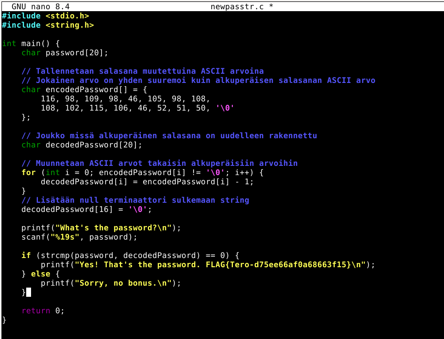

# h3 No Strings Attached

## Käsitteet
- **Binääri**: kääntäjän (esim. gcc) tuottama tiedosto, jonka tietokone osaa suorittaa. Ihminen ei voi lukea sitä suoraan, kuten lähdekoodia.
- **'strings'**: komento, joka tulostaa tiedostosta kaikki luettavat merkkijonot. Jos ohjelmaan on kirjoitettu salasana suoraan koodiin, se löytyy binääristä sellaisenaan.
- **ASCII**: taulukko, jossa jokaista merkkiä vastaa numero (esim. `a` = 97)
- **Packer (esim. UPX)**: työkalu, joka pakkaa ohjelman. ohjelma toimii edelleen, mutta se sisältö ei ole enään luettavassa muodossa, joten `strings` ei näytä alkuperäisiä merkkijonoja.

## a) Strings
**Tavoite** Löytää `passtr`-ohjelman salasana ja flag komennolla `strings`.
 1. Latasin `ezbin-challenges.zip`-tiedoston ja purin sen.
 2. Menin `passtr`-kansioon ja luin `README`-tiedoston
 
  
  
 3. Ajoin ohjelman `./passtr`, joka kysyi salasanaa. Laitoin `lol` ja ohjelma sanoi "Sorry, no bonus." 
 
 
 
  4. Kokeilin komentoa

```bash
 Strings passtr
```
Tulosteesta löytyi merkkijono `sala-hakkeri-321`, joka voisi olla potentiaalinen salasana. 

  
  
5. Ajoin ohjelman uudelleen ja syötin `sala-hakkeri-321`. Ohjelma hyväksyi salasanan ja tulosti lipun.

  

**Tulos:** Salasana on `sala-hakkeri-321`.

 ## b) Salasanan piilottaminen binääristä

**Tavoite:** Tehdä`passtr.c`:stä uusi versio, jossa salasana ei näy binäärissä sellaisenaan, ja todistaa sen testillä. 
 
**Ideani:** Salasanaa ei tallennettaisi tekstinä vaan ASCII-numeroina, joihin on tehty pieni muutos. Ohjelma laskee oikean salasanan vasta ajon aikana. Tällöin `strings` ei löydä salasanaa, koska sitä ei ole binäärissä yhtenä merkkijonona. 

**Toteutus:**

1. Loin uuden tiedoston ja kopioin siihen alkuperäisen koodin:

```bash
   touch newpasstr.c
```
2. Idea oli muuttaa salasana ASCII-numeroiksi ja pienentää jokaista arvoa yhdellä, mutta en ollut varma, toimiiko se näin. Kysyin ChatGPT:ltä, voiko sen tehdä noin ja miten se toteutetaan tähän koodiin. ChatGPT vahvisti, että idea toimii, ja näytti, miten salasana muutetaan ASCII-arvoiksi ja puretaan takaisin ajon aikana. Kirjaimesta `s` (115) tulee siis `t` (116), kirjaimesta `a` (97) tulee `b` (98) jne. Koodin muokkaamisen tein itse ohjeen pohjalta.

alkuperäinen koodi:

 
 

 Muutettu koodi:


 
  
3. koodin toimintaperiaate:
  - `encodedPassword` sisältää salasanan numeroina, joista jokainen on yhden suurempi kuin alkuperäinen merkki.
   - `for`-silmukka käy taulukon läpi ja vähentää jokaisesta arvosta 1. Näin syntyy alkuperäinen salasana `decodedPassword`-taulukkoon.
   - Lopuksi lisätään merkkijonon päättävä `'\0'`, jotta `strcmp` tietää, missä merkkijono loppuu.
   - Käyttäjän syöttämää salasanaa verrataan `decodedPassword`:iin.
4. Tallensin muutokset (`Ctrl+o`, `Ctrl+x`) ja käänsin ohjelman:

```bash
   gcc newpasstr.c -o newpasstr
```

**Testit:**

```bash
strings newpasstr
```
Tulosteessa ei näy `sala-hakkeri-321`.


Testasin vielä, että ohjelma toimii edelleen: ajoin `./newpasstr` ja syötin `sala-hakkeri-321`. Salasana hyväksyttiin.

**Tulos:** Salasana ei enää näy binäärissä sellaisenaan, mutta ohjelma toimii kuten ennen.


## c) Packd

**Tavoite:** Selvittää `packd`-ohjelman salasana ja lippu.
1. Avasin `packd`-kansion ja luin `README`-tiedoston.
2. Ajoin `./packd` ja syötin `lol`. Vastaus oli "no bonus".
3. Kokeilin `strings packd`. Tulosteesta löytyi `piilos-An`, mutta se ei toiminut salasanana. Kuvakaappauksessa on `strings packd_backup`, koska unohdin ottaa kuvan silloin, kun tein sen alkuperäisellä tiedostolla. (Olin tehnyt tiedostosta varmuuskopion ennen purkamista.)

   

4. Luin `strings`-tulostetta tarkemmin ja löysin siitä linkin, josta pääsi lataamaan työkalun nimeltä **UPX**. Tämä viittasi siihen, että ohjelma on pakattu UPX:llä. Pakattu ohjelma ei näytä `strings`-komennolle alkuperäisiä merkkijonojaan, ja siksi kokonaista salasanaa ei löytynyt, vain sen pätkä.
5. Asensin UPX:n ja katsoin ohjeen komennolla `upx --help`. Sen jälkeen purin ohjelman:

```bash
   upx -d packd
```

   (`-d` = decompress, eli pura pakkaus.)

   

6. Ajoin `strings packd` uudelleen. Nyt tulosteesta löytyi koko salasana.

   

7. Ajoin `./packd` ja syötin `piilos-AnAnAs`. Ohjelma hyväksyi salasanan ja tulosti lipun.

   

**Tulos:** Salasana on `piilos-AnAnAs`.

**Mitä opin:** Packer piilottaa merkkijonot `strings`-komennolta, mutta ei suojaa ohjelmaa oikeasti: kun pakkaus puretaan, sisältö on taas luettavissa. Tärkein huomio on se, että `strings`-tulosteen lukeminen tarkasti (tässä UPX-linkki) paljasti, mitä työkalua kannattaa kokeilla seuraavaksi.

---

## Lähteet
- Tehtävänanto ja ezbin-challenges: Tero Karvinen, terokarvinen.com
- UPX: linkki, joka löytyi `strings`-tulosteesta
- ChatGPT: käytin apuna salasanan ASCII-muunnoksessa (b-kohta)
- Claude: raportin selkeyttäminen, käsitteiden selitykset ja markdown-muotoilu 

