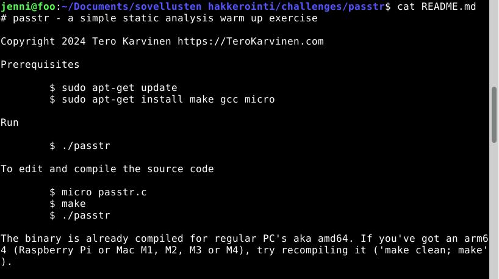
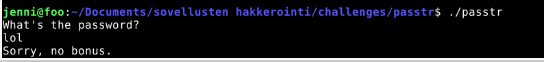
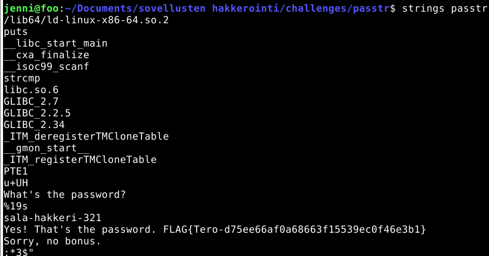
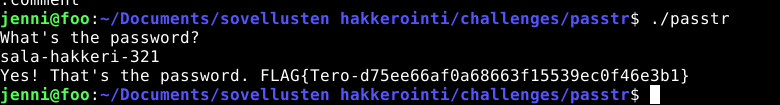
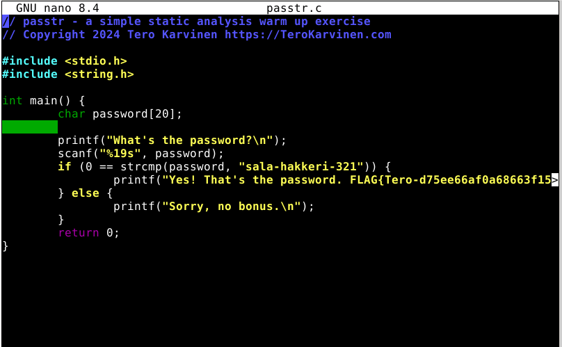
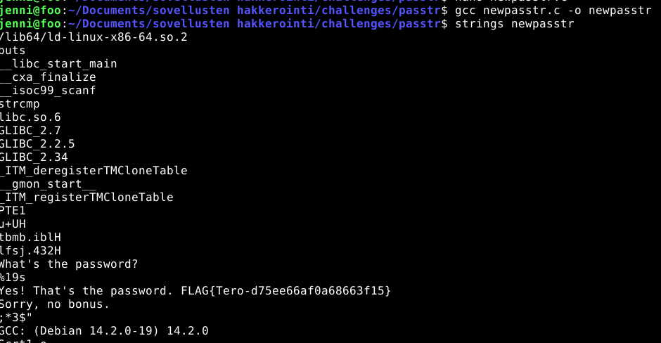
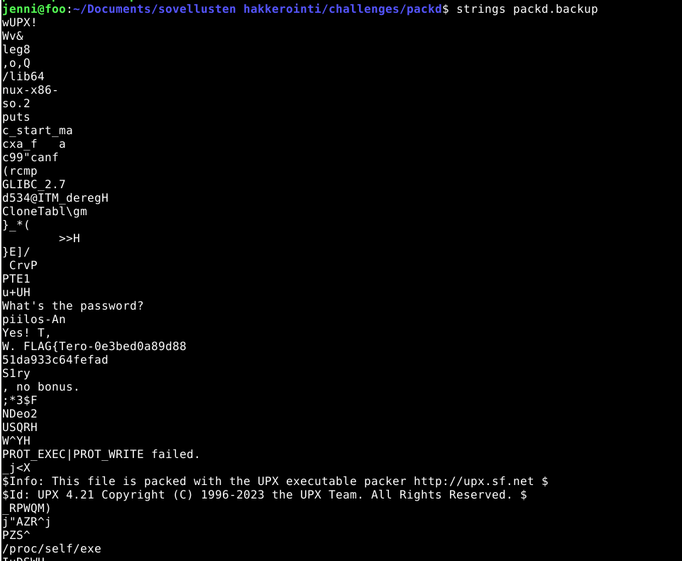
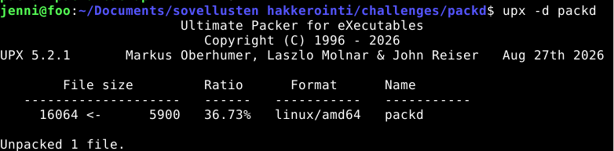
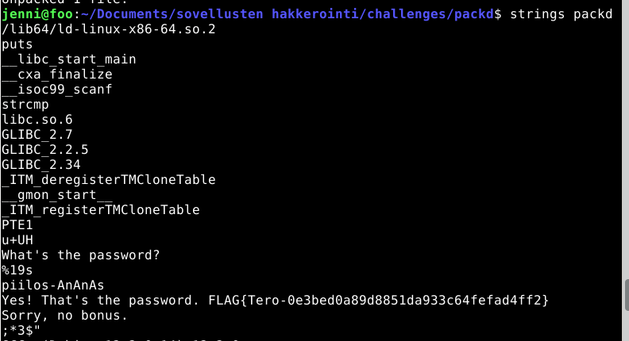
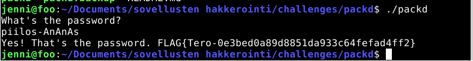

# h3 No Strings Attached

## a) Strings. Download ezbin-challenges.zip. Run 'passtr'. Find the correct password using 'strings'. Also find the flag.
 Ensin latasin ton  ezbin-challenges.zip. tiedoston. 
 Sen jälkeen purin zip tiedoston ja aloin tekemään tehtävää.

 aluksi menin siihen passtr tiedostoon ja katsoin mitä se sisältää. Aluksi avasin README tidoston ja luin sen. 
 
  
  
 Sitten ajoin ohjelman ./passtr, joka kysyi salasanaa. Laitoin lol ja se sanoi no bonus. 
 
 
 
 Sitten kokeilin komentoa strings passtr. 
 
  
  
 Sen jälkeen kun löysin potentiaalisen salasanan  eli sala-hakkeri-321 niin, kokeilin toimiiko se. Ajoin taas ./passtr ja kirjoitin sala-hakkeri-321 ja tulostui salasana on oikein ja flag. 

  

 ## b) Make a new version of the passtr.c program where the password doesn't appear directly as-is in the binary. Demonstrate with a test that the password doesn't appear.
Ensin loin uuden tiedoston newpasstr.c touch komennolla. Sitten kopion passtr.c koodin sinne.

Eli pitää yrittää muuttaa koodia niin, että salasana ei enään näkyisi sellaisena kuin se on, kun kirjoitetaan tuo strings passtr. 

Salasanan voisi muuttaa ascii muotoon ja sitten tehdä decryptattu ascii salasana, jossa oikeasta ascii muotoisesta salasanasta miinustetaan -1, että tulee erilainen salasana string. 
Kysyin chatgbt:ltä miten saisin tehtyä tämän tähän koodiin ja se muutti salasanan ascii muotoon ja kertoin miten muokkaan koodia, että saan tehtyä tämän. 
alkuperäinen koodi:

 
 

 muutos:

 
  

Lopuksi tallensin muutokset ctrl + o ja ctrl + x. Käänsin newpasstr.c komennolla gcc newpasstr.c - o newpasstr. Sitten kokeilin strings newpasstr ja se näytti:

sitten kokeilin vielä toimiiko salasana ajamalla ./newpasstr, joka kysyy salasanaa ja laitoin sen sala-hakkeri-321 ja se edelleen toimii, vaikka ei näy strings newpasstr enään.

## c) Packd. Run 'packd' from the package ezbin-challenges.zip. What is the password? What is the flag?
Aluksi avasin packd kansion ja katsoin mitä se sisältää. Luin README tiedoston. Ajoin sen jälkeen ./packd ja se kysyi salasanaa ja kirjoitin lol. Tuli vastaukseksi no bonus. Sen jälkeen kokeilin strings packd mutta kuvakaappauksessa on strings packd_backup, koska unohdin ottaa silloin sillä hetkellä tästä kuvakaappauksen ja sain piilos-An. Kokeilin sitä, kun ajoin taas ./packd ja se kysyi salasanaa ja kirjoitin tuo sinne. Se sanoi no bonus. 

Sitten menin lukemaan tuota strings packd tulostusta tarkemmin ja löytyi linkki, missä voi asentaa upx-työkalun. Asensin sen ja katsoin upx --help mitä komentoja voin käyttää. Kokeilin upx -d packd.

Sen jälkeen sitten kirjoitin strings packd, josta löysin uuden salasanan, jota kokelin.

Ajoin taas ./packd ja se kysyi salasanaa, johon kirjoitin piilos-AnAnAs. Ohjelma sanoi, että salasana on oikein ja sain flagin. 

