# h4 Some Disassembly Required

## b) 

Avasin Ghidran terminaalissa komennolla 

```bash
./ghidraRun
```

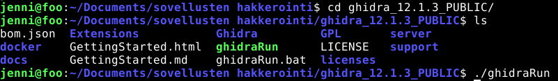

Kun Ghidra oli avautunut, menin kohtaan **File → Import File** ja valitsin `packd`-tiedoston omasta hakemistostani. Kun `packd` tuli näkyviin Ghidrassa, kaksoisklikkasin sitä. Ghidra kysyi, haluanko analysoida tiedoston, joten painoin **Yes** ja sen jälkeen **Analyze**.

Analyysin jälkeen menin Ghidrassa vasemmalla olevaan **Symbol Tree** -kohtaan. Sen alapuolella olevassa Filter-kentässä hain `main`-funktiota ja valitsin Functions-kohdasta `main`-funktion.

Ghidran oikealle puolelle avautui **Decompiler**-näkymä, jossa näkyi `main`-funktion Ghidran muodostama C-kielinen esitys:


Alkuperäinen Ghidran näyttämä koodi oli:


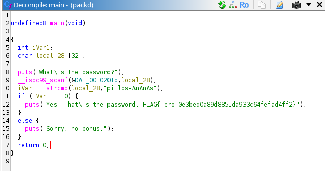

Aluksi Ghidra oli nimennyt muuttujat esimerkiksi `iVar1` ja `local_28`. Muutin nämä kuvaavammiksi nimiksi, jotta ohjelman toimintaa olisi helpompi ymmärtää. Muutin `local_28` muuttujaksi `password`, koska siihen tallennetaan käyttäjän syöttämä salasana. Muutin `iVar1` muuttujaksi `comparison_result`, koska siihen tallennetaan `strcmp`-funktion palauttama vertailun tulos.

Tutkin myös DAT_0010201d-kohtaa, että voisin selvittää, mitä scanf-funktiolle annettu parametri tarkoittaa. Ghidrassa painoin decompilerissä tuota DAT_0010201d-kohtaa ja ghidra näytti muistiosoitteessa:

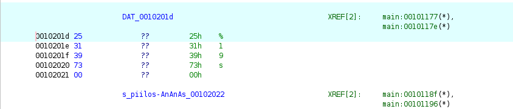

Tavujen ASCII-arvot ovat %, 1, 9, s ja merkkijonon lopettava 00. Tästä pystyin päättelemään, että kyseessä on merkkijono %19s.

Tämän perusteella scanf-kutsun voi esittää C-kielessä muodossa:


```c

scanf("%19s", password);

```

%19s tarkoittaa, että käyttäjältä luetaan merkkijono, jonka pituus voi olla enintään 19 merkkiä.

Muuttujien nimeämisen ja löydetyn scanf-formaatin perusteella sain ohjelmasta selkeämmän C-kielisen version:


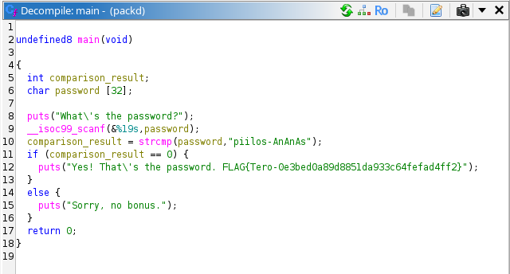

Ohjelma siis ensin pyytää käyttäjältä salasanaa. Käyttäjän anatama salasana tallennetaan password-muuttujaan. Tämän jälkeen ohjelma käyttää strcmp-funktiota vertaamaan käyttäjän antamaa salasanaa merkkijonoon piilos-AnAnAs. 

strcmp palauttaa arvon 0, jos kaksi merkkijonoa on samanlaiset. Tämän vuoksi ohjelma tarkistaa.
```c

if (comparison_result == 0)

```
Jos salasana on piilos-AnAnAs, ohjelma tulostaa ilmoituksen yes! that's the password, sekä flagin. Jos salasana on jokin muu, ohjelma tulostaa Sorry, no bonus.

## c)
Menin ghidraan ja siellä taas sinne **File → Import File** ja valitsin passtr omasta hakemistosta. Sitten, kun `passtr` tuli näkyviin Ghidrassa, kaksoisklikkasin sitä. Ghidra kysyi, haluanko analysoida tiedoston, joten painoin **Yes** ja sen jälkeen **Analyze**.

Analyysin jälkeen menin Ghidrassa vasemmalla olevaan **Symbol Tree** -kohtaan. Sen alapuolella olevassa Filter-kentässä hain `main`-funktiota ja valitsin Functions-kohdasta `main`-funktion.

Ghidran oikealle puolelle avautui **Decompiler**-näkymä, jossa näkyi `main`-funktion Ghidran muodostama C-kielinen esitys. 

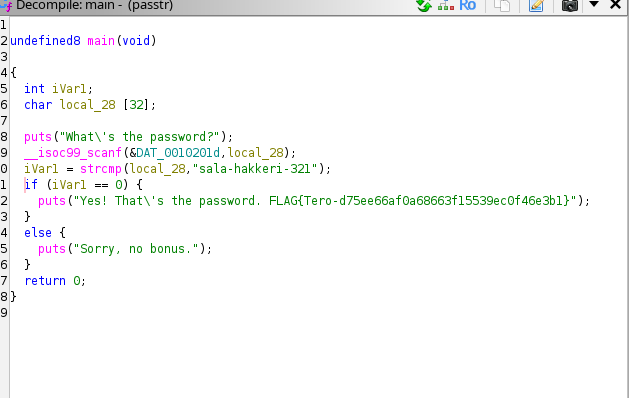

Siellä tarkastelin if-ehtoa, jossa ohjelma tarkistaa annetun salasanan oikeellisuuden. Ghidran Listing-näkymässä näkyi ehtoon liittyvä JNZ-käsky. JNZ tulee sanoista Jump if Not Zero, eli "hyppää, jos tulos ei ole nolla". Se on ehdollinen hyppykäsky, jonka avulla ohjelma päättää, mihin kohtaan ohjelman suoritus jatkuu aikaisemman vertailun perusteella.

JNZ kohtaa pääsin muokkaamaan painamalla hiiren oikeaa puolta, johon tuli patch instructions. Sitten muutin sen JZ. JZ tulee sanoista Jump if Zero, eli "hyppää, jos tulos on nolla". Näin vaihdoin ehdollisen hypyn päinvastaiseksi. Muutoksen jälkeen myös Decompiler-näkymän koodi muuttui:

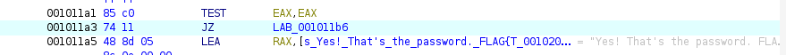


Sitten menin ghidrassa file -> export program. Sitten menin terminaaliin menin passtr hakemistoon kirjoitin chmod +x, joka antaa ajo oikeudet?

Sitten ajoin ohjelamn /.passtr ja kirjoitin alkuperäisen salasanan:

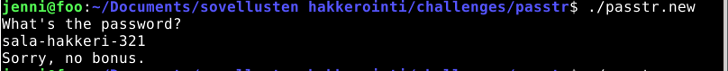

sitten kirjoitin väärän salasanan 

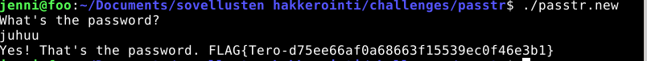


## e1)
Latasin crackme-tehtävät Githubista. README.md ohjeen mukaan tehtävänä oli selvittää, miten crackme-ohjelma saadaan päättymään exit status -arvolla 0. Tarkoituksena oli tehdä reverse engineering binaarista ilman alkuperäisen lähdekoodin tarkastelua.

Aloitin rakentamalla ensmimmäisen crackmen Makefilen avulla:

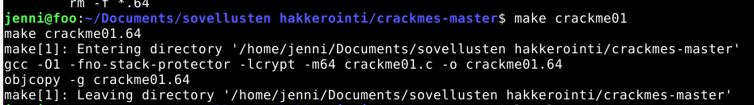

```bash
make crackme01
```
Tämä loi 64-bittisen crackme01.64-binaarin. Kokeilin ensin suorittaa ohjelmaa ilman argumenttia:

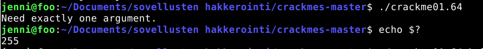

```bash
./crackme01.64
```
Ohjelma ilmoitti

```bash
Need exactly one argument.
```
Tarkistin ohjelman exit statuksen komennolla:

```bash
echo $?
```
Tulokseksi tuli 255. 

**echo $?** näyttää edellisen suoritetun komennon exit statuksen eli ohjelman palauttaman paluuarvon. Tässä tehtävässä tavoitteena oli saada ohjelma palauttamaan arvo 0, koska README mukaan crackme piti saada päättymään statuskoodilla 0.

Seuraavaksi kokeilin ohjelmaa yhdellä argumentilla:

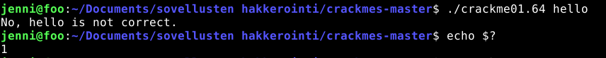

``` bash
./crackme01.64 hello
```
Ohjelma vastasi:

```bash
No, hello is not correct.
```
Sitten testasin taas sen echo $? ja sain arvoksi 1. 

Sen jälkeen avasin crackme01.64-binaarin ghidrassa ja tarkastelin main-funktion decompiler näkymää. 

Decompilerista näkyi:

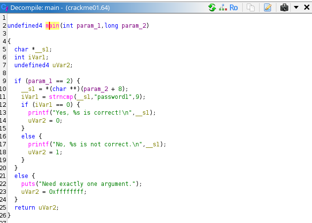

Tämä oli mielenkiintoinen kohta, sillä käyttäjän syötettä verrataan merkkijonoon password1:

```bash
iVar1 = strncmp(__s1,"password1",9);
``` 

__s1 sisältää käyttäjän syötteen. strncmp vertailee sitä merkkijonoon password1. Seuraavassa ehdossa tarkistetaan, onko vertailun tulos 0:

```c
if (iVar1 == 0)
```

Jos tulos on 0, ohjelma tulostaa, että annettu arvo on oikein ja asettaa palautusarvoksi 0:

```c
uVar2 = 0;
```

Tämän perusteella testasin:

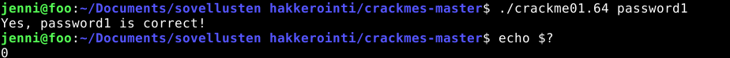

```bash
./crackme01.64 password1
```

Ohjelma ilmoitti:
```bash
Yes, password1 is correct!
```

Tarkistin tämän jälkeen exit statuksen:
```bash
echo $?
```

Tulokseksi tuli: 0

## e2)
Tein saman alustuksen kuin edellisessä kohdassa.

Sitten avasin ghidran, menin main funktioon ja tutkin decompilerista koodia. Sieltä sain uuden merkkijonon, jota käyttäjän syötettä vertaillaan. 

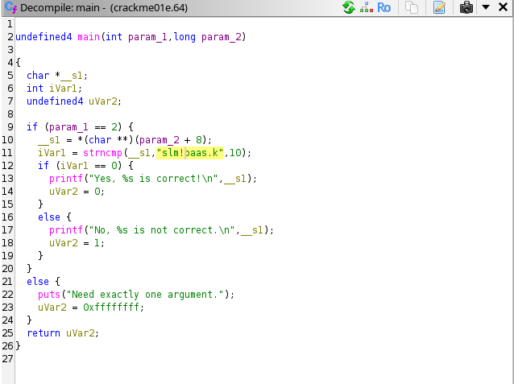

Kokeilin sitä terminaalissa:

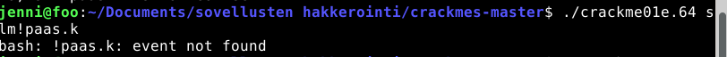

Aluksi sain väärin tämän, koska se ei hyväksynyt !-merkkiä.

Sitten kokeilin ''-sisään laittaa merkkijonon:

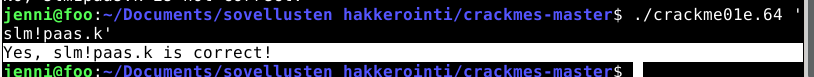

Vastaukseksi sain, että merkkijono oli oikein ja echo $? 

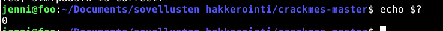

Antoi tulokseksi: 0.


## f)
Alotin tehtävän samalla tavalla kuin edelliset tehtävät

main funktion decompile näkymä:

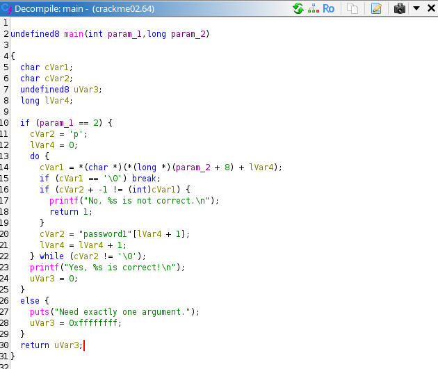

muutettu funktioiden nimiä:

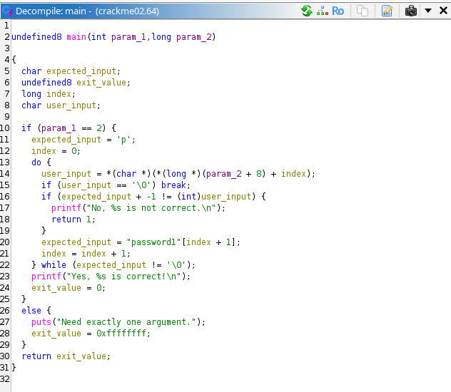

merkkijonon selvittäminen:

Ghidrassa tarkastelin main-funktion Decompiler-näkymää ja huomasin, että ohjelma ei suoraan vertaillut käyttäjän syötettä oikeaan salasanaan. Aluksi muuttujalle expected_input annetaan arvo 'p':

 expected_input = 'p';

```c
expected_input = 'p';
```

Käyttäjän antaman argumentin seuraava merkki tallennetaan `user_input`-muuttujaan. Tämän jälkeen ohjelma tarkistaa:

```c
if (expected_input + -1 != (int)user_input)
```

Tästä päättelin, että käyttäjän antaman merkin täytyy olla yksi ASCII-arvo pienempi kuin `expected_input`.

Ensimmäisellä kierroksella `expected_input` on `'p'`. ASCII-arvona `p` on 112, joten:

```text
112 - 1 = 111
```

ASCII-arvo 111 vastaa merkkiä `o`. Ensimmäisen syötetyn merkin täytyy siis olla `o`.

Seuraavalla kierroksella `expected_input` saa arvon merkkijonosta `password1`:

```c
expected_input = "password1"[index + 1];
```

Tämän perusteella kävin merkkijonon merkit läpi ja vähensin jokaisen merkin ASCII-arvosta yhden. Näin sain ohjelman odottaman merkkijonon:

```text
password1
↓ ASCII-arvosta -1
o`rrvnqc0
```

Testasin löytämääni merkkijonoa ohjelmalla:

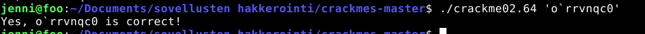

```bash
./crackme02.64 'o`rrvnqc0'
```
Ohjelma hyväksyi syötteen. 

Ohjelmassa on pieni heikkous:

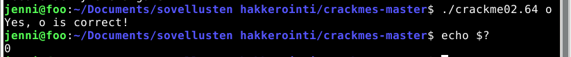

Ohjelma toimii jos kirjoittaa myös pelkän o-kirjaimen. 


Lähteet:
- Käytin tekoälyä markdown muotoiluun, käsitteiden selittämiseen ja koodin tulkitsemiseen. GPT-5.6 Luna.
